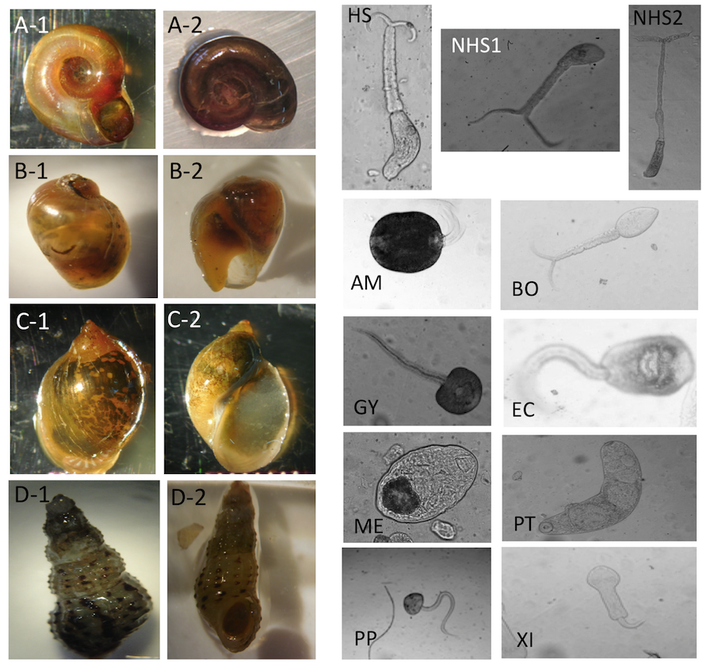

# CNNs-snail-parasite

Transfer learning using VGG16 and convolutional neural networks (CNNs) to classify images of freshwater snails and parasites. This automated detection approach is expected to make infectious disease control more efficiently in the field.

## Code
The script is in Python, building CNNs and transfer learning (with VGG16), using Keras package with Tensorflow backened. Augmenting in training data is also built in the code (to overcome the unbalanced datasets).

Main script: cnn_transfer_learning_2.py
--> the scripts here can be used for different image classification tasks.

## Requirements
- [Anaconda / Python 3.5](https://www.continuum.io/downloads)
- [TensorFlow 1.2](https://www.tensorflow.org/)

## Note
Note that the image dataset is the property of De Leo Lab of Hopkins Marine Station at Stanford University. The images will be released with the publication in few months.

Image examples for snail and parasite classes. For snail classes, A-1 and A-2: Biomphalaria. B-1 and B-2: Bulinus. C-1 and C-2: Lymnaea. D-1 and D-2: Melanoides. For parasite classes, HS: Human-schisto, NHS1: Nonhuman- schisto forktail type I, NHS2: Nonhuman- schisto forktail type II, AM: Amphistome, BO: Bovis, EC: Echino, GY: Gymno, ME: Metacerc, PP: Parapleurolophocercous, PT: Parthenitae, XI-Xiphidiocercariae.

## Relevant links
Links:
- [The Program for Disease Ecology, Health and the Environment](http://www.theupstreamalliance.org/)
- [Prawn vs. Snail: Nature’s Role in Fighting Disease](https://woods.stanford.edu/news-events/news/prawn-vs-snail-natures-role-fighting-disease)

